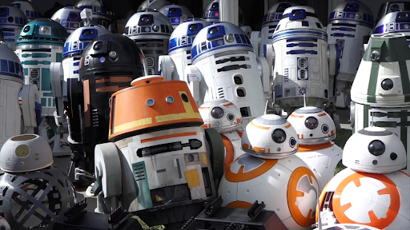
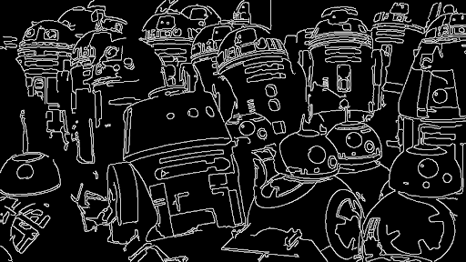

# Day 08 - Robot Operating System Bootcamp
## Visual perception in robotics
Summary: Every year computer vision becomes more and more popular in modern robotics. This is because CV is one of the most powerful tools that allow you to make great things with a just single camera (or maybe a number of cameras). This day will help you acquire skills with computer vision into ROS.

## Contents
   1. [Chapter I](#chapter-i)  \
      1.1. [Preamble](#preamble)
   2. [Chapter II](#chapter-ii) \
      2.1. [Instructions](#instructions)
   3. [Chapter III](#chapter-iii) \
      3.1. [Specific instructions of the day](#specific-instructions-of-the-day)
   4. [Chapter IV](#chapter-iv) \
      4.1. [Exercise 00 : Publisher and color space switcher](#exercise-00--publisher-and-color-space-switcher)
   5. [Chapter V](#chapter-v) \
      5.1. [Exercise 01 : Image correction](#exercise-01--image-correction)
   6. [Chapter VI](#chapter-vi) \
      6.1. [Exercise 02 : Canny detector](#exercise-02--canny-detector)
   7. [Chapter VII](#chapter-vii) \
      7.1. [Exercise 03 : Aruco detector](#exercise-03--aruco-detector)

## Chapter I
### Preamble
The history of computer vision dates back to the 1960s and nowadays computer vision is one of the most actively developing areas in robotics. It is widespread in our daily life. You can see CV everywhere: from your vacuum cleaner robots to smart cities. You can easily unlock your cell phone or pay in some coffee shops using your face looking at the camera. All of that becomes real due to CV.

In robotics CV helps in such tasks as obstacle avoidance, localization, navigation and path planning. 

## Chapter II
### Instructions
* Use this page as the only reference. Do not listen to any rumors and speculations about how to prepare your solution.
* Here and further we use ROS Melodic and C++.
* Pay attention to the permissions of your files and directories.
* To be assessed your solution must be in your GIT repository.
* Your solutions will be evaluated by your peers.
* You should not leave any additional file in your directory other than those explicitly specified in the subject. It is recommended that you modify your .gitignore to avoid accidents.
* When you need to get a precise output in your program, it is forbidden to display a precalculated output instead of performing the exercise correctly.
* Have a question? Ask your neighbor on the right. Otherwise, try your neighbor on the left.
* Your reference manual: peers / Internet / Google.
* You can ask questions in Slack.
* Read the examples carefully. They could very well call for details that are not explicitly mentioned in the subject…

And may the Force be with you!


## Chapter III
### Specific instructions of the day
* Use **[image_transport]**  for publishing / subscribing *ROS* Image messages
* Use **[cv_bridge]** for converting between *ROS* images and *OpenCV* images
* Use **[dynamic_reconfigure]** for dynamic reconfiguration

## Chapter IV
### Exercise 00 : Publisher and color space switcher

Directory to store your solution : ex00

Files to be in the directory : All the necessary files to run your ROS package

Authorized functions : All the necessary functions from cv2 and ROS to write your node(s)

Comments :

In this exercise, you will need to write publisher and color space switcher nodes just like publisher / subscriber from the 1st day exercise but for images.

Create the **Publisher node** that can:
* read *misc/images/awesome_robot.png* 
* convert *OpenCV* image to *ROS* image
* publish image into *ROS* **/image/color** topic with *10 Hz* frequency 

Create the **Color switcher node** that can:
* subscribe to *ROS* **/image/color** topic and get the image
* convert *ROS* image to *OpenCV* image
* convert color space of image from **RGB** to **Gray**
* convert *OpenCV* image to *ROS* image
* publish new gray image to the *ROS* topic **/image/gray** at about the same frequency as the **Publisher node**

Add the launch file:

* write the launch file **day_08_ex_00.launch** that will run your nodes and place it into the *launch* folder
	
What you need to achieve as the result is below:

* You should have publisher node which read image from file and publishes it into **/image/color** topic with *10 Hz* frequency 
* You should have subscriber node which gets image from **/image/color** topic, changes it color to gray and sends new image into **/image/gray** topic with approximately *10 Hz* frequency
* You  should have the launch file **day_08_ex_00.launch** that runs both publisher and subscriber nodes

|                   Color Image                    |                    Gray Image                    |
|:------------------------------------------------:|:------------------------------------------------:|
|  |  |

## Chapter V

### Exercise 01 : Image correction

Directory to store your solution : ex01

Files to be in the directory : All the necessary files to run your ROS package

Authorized functions : All the necessary functions from cv2 and ROS to write your node(s)

Comments :

In this exercise, you will work with dynamic reconfiguration and image correcting .

First thing you need to do is reuse image publisher node from the previous exercise that will publish *misc/images/broken_image.png* to **/image/origin**

After that you need to set up your dynamic reconfiguration.

* Write **ImgProcessing.cfg** for dynamic reconfiguration and place it into **cfg** folder. It should contain:

   * parameter for contrast (from 0 to 10)
   * parameter for brightness (from -255 to 255)
   * parameter for gamma correction (from 0 to 10)

* Be sure that you change **CmakeList.txt** for dynamic reconfiguration config file
	
And now you can start to correct our broken image:

* Add dynamic reconfiguration server:
   * create dynamic reconfigure server and its callback in your node for operating dynamic params

* Subscribe to **/image/origin** topic and get the image

* Add Contrast-Brightness correction:
   * Correct the broken image according to the following formula:
$
image_{corrected} = \alpha \cdot image_{origin} + \beta, \text{ where } \alpha \text{ and } \beta \text{ control contrast and brightness respectively}
$
   * Publish image with contrast-brightness correction into **/image/contrast_brightness** topic

* Add Gamma correction: 
   * Correct the broken image according to the following formula:
$
image_{corrected} = (\frac{image_{origin}}{255})^\gamma \cdot 255, \text{ where } \gamma \text{ is gamma correction parameter}
$
   * Publish image with gamma correction into **/image/gamma** topic

Add the launch file:

* Write the launch file **day_08_ex_01.launch** that will run publisher and image correction nodes and place it into the launch folder


What you need to achieve as the result is below:
* You should have image publisher that publishes *broken_image.png* to **/image/origin**
* You should have image correction node with:
   * **/image/contrast_brightness** topic for contrast-brightness corrected image
   * **/image/gamma** topic for gamma corrected image
* You should have the possibility to dynamically change **contrast**, **brightness** and **gamma** correction parameters from the dynamic reconfigure server. You can use [rqt_reconfigure] node as GUI for changing params
* You  should have the launch file **day_08_ex_01.launch** that runs your image correction node and image publisher node

|              Broken Image               |              Corrected Image               |
|:---------------------------------------:|:------------------------------------------:|
|  |  |

## Chapter VI

### Exercise 02 : Canny detector

Directory to store your solution : ex02

Files to be in the directory : All the necessary files to run your ROS package

Authorized functions : All the necessary functions from cv2 and ROS to write your node(s)

Comments :

In this exercise, you will write a simple canny detector which was developed by John F. Canny in 1986. It uses an image kernel for outlining edges on an image. You can learn more about image kernels and look at different examples [here][kernels_examples].

First thing you need to do is reuse image publisher node from the previous exercise that will publish *misc/images/image_with_pretty_edges.png* to **/image/origin**

Add dynamic configuration:

* Write **CannyDetection.cfg** for dynamic reconfiguration. It should contain:
   * params for blur kernel size (it can be only 3, 5 or 7, you have to control this using enums in .cfg file)
   * params for canny low threshold (from 0 to 1000)
   * params for canny high threshold (from 0 to 10000)
   * params for canny kernel size (it can be only 3, 5 or 7, you have to control this using enums in .cfg file)
* be sure that you change **CmakeList.txt** for dynamic reconfiguration config file

And now you are ready to give the edge detector to your robot!

* Add dynamic reconfiguration server:
   * create dynamic reconfigure server and its callback in your node for operating dynamic params

* Subscribe to **/image/origin** topic and get the image

* Convert color space of image from *RGB* to *Gray*

* Add image blurring:
   * apply **blur filter** (The Gaussian filter) from *OpenCV* library with the kernel size from dynamic params to the image for filtering out any noise

* Canny:
   * apply **canny detector** from *OpenCV* library to the blurred image

* Publish image with detected edges on the black background into **/image/canny** topic with approximately the same frequency as **/image/origin** topic has

Add the launch file
* Write the launch file day_08_ex_02.launch that will run your nodes and place it into the *launch* folder

What you need to achieve as the result is below:

* Image publisher that publishes *image_with_pretty_edges.png* to **/image/origin**
* Canny detector node with
   * **/image/canny** topic with detected edges
   * the possibility to dynamically change **canny low threshold**, **canny high threshold**, **blur kernel** and **canny kernel**  from dynamic reconfigure server. You can use [rqt_reconfigure] node as GUI for changing params
* You  should have the launch file **day_08_ex_02.launch** that runs your canny detection node and image publisher node

|                   Original Image                   |                 Canny Image                 |
|:--------------------------------------------------:|:-------------------------------------------:|
|  |  |

## Chapter VII

### Exercise 03 : Aruco detector

Directory to store your solution : ex03

Files to be in the directory : All the necessary files to run your ROS package

Authorized functions : All the necessary functions from cv2 and ROS to write your node(s)

Comments :

In this exercise, you will learn how to work with [AR markers][opencv_ar_markers]. 

Run rosbag with video (--loop for infinite loop)
```
rosbag play --loop Day08/misc/bags/day_08_circle.bag
```

And this is where the magic begins! Write your AR markers detector:

* subscribe to the **/camera/color/image_raw** topic with images and to the **/camera/image_info** topic with the image info (like camera internal parameters and distortion)


* detect Aruco markers from image with *OpenCV*'s `detectMarkers()` method (use [cv::aruco::DICT_6X6_1000][cv_aruco_dict] dictionary for markers)

* draw ID and boundary of markers with `drawDetectedMarkers()` method and then send it to **/camera/markers** topic 

* estimate pose of marker in respect to camera frame using `estimatePoseSingleMarkers()` method (you can get camera internal params and distortion coefficients from **/camera/image_info** topic)
* calculate inverse transform (you need to know pose of camera in respect to marker frame) and then send it to **/tf** topic using [tf_broadcaster]. The **marker_frame** should be the parent frame and the **camera_frame** should be the child frame

Add the launch file

* write the launch file **day_08_ex_03.launch** that will run the node

What you need to achieve as the result is below:
* You should have Aruco detector node with
**/camera/markers** topic with detected markers
**/tf**  topic with pose of markers in respect to camera_frame
* You should have the launch file **day_08_ex_03.launch** that runs your node


[image_transport]: http://wiki.ros.org/image_transport
[cv_bridge]: http://wiki.ros.org/cv_bridge
[dynamic_reconfigure]: http://wiki.ros.org/dynamic_reconfigure
[kernels_examples]: https://setosa.io/ev/image-kernels/
[rqt_reconfigure]: http://wiki.ros.org/rqt_reconfigure
[opencv_ar_markers]: https://docs.opencv.org/master/d5/dae/tutorial_aruco_detection.html
[cv_aruco_dict]: https://docs.opencv.org/4.x/d9/d6a/group__aruco.html#ggac84398a9ed9dd01306592dd616c2c975a6eb1a3e9c94c7123d8b1904a57193f16
[tf_broadcaster]: http://wiki.ros.org/tf/Tutorials/Writing%20a%20tf%20broadcaster%20%28C%2B%2B%29
